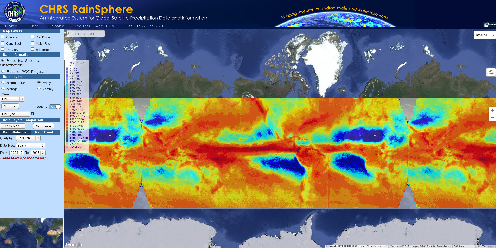

.. nbsphinx-rtd-test documentation master file, created by
   sphinx-quickstart on Wed Sep 28 16:20:38 2016.
   You can adapt this file completely to your liking, but it should at least
   contain the root `toctree` directive.

Willkommen zu einer Sammlung von Praktikumsaufgaben
===================================================

Intro
-----

Übersicht
---------
Folgende Aufgaben sind abgelegt

* :doc:`Satelliten-basierte Niederschlagsmessung  <Satellite_based_Precip>` 

            

.. toctree::
   :maxdepth: 1 
   :hidden:
   :caption: Uebersicht
   
   Satellite_based_Precip
   

