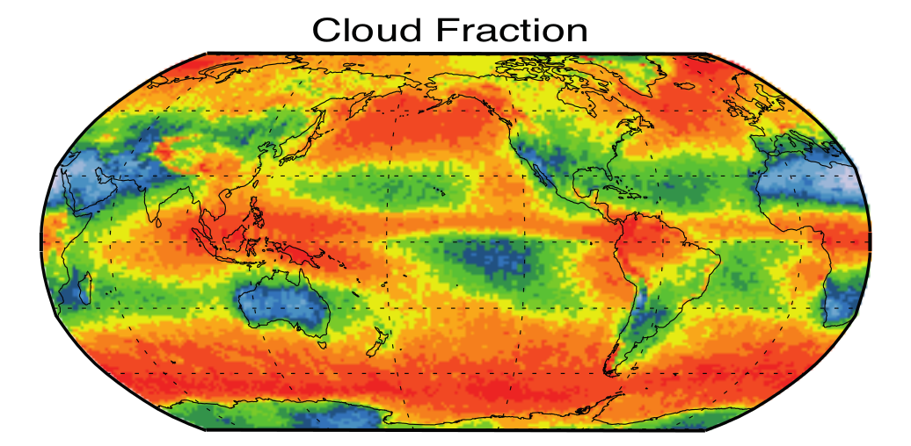
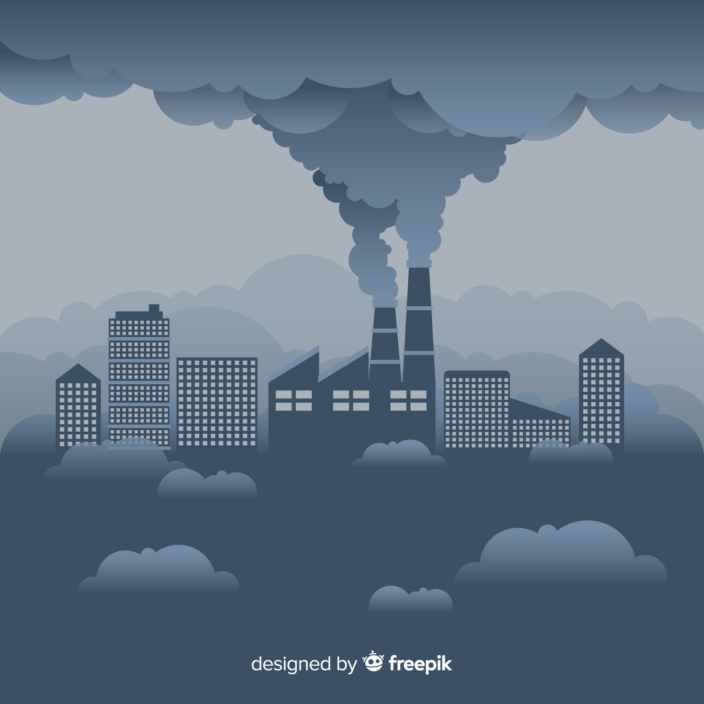

.. nbsphinx-rtd-test documentation master file, created by
   sphinx-quickstart on Wed Sep 28 16:20:38 2016.
   You can adapt this file completely to your liking, but it should at least
   contain the root `toctree` directive.

Willkommen zu einer Sammlung von Praktikumsaufgaben
===================================================

Intro
-----
Hier befindet sich eine kleine Sammlung von Aufgaben und Ideen, mit denen sich Praktikanten 
bei uns am TROPOS beschäftigen könnten. Für Schülerpraktikanten sollte vielleicht nur
der leichtere Teil der Aufgaben ausgewählt werden.

Übersicht
---------
Aus folgende Aufgaben kann eine ausgewählt werden:

* :doc:`Satelliten-basierte Niederschlagsmessung  <Satellite_based_Precip>` 
.. image:: rainsphere.png
            :width: 300 px
* :doc:`Wolken und ihre Klimawirkung  <Wolken_und_ihre_Klimawirkung>` wird durch das Jupyter Notebook :doc:`Analyse von globale ICON Simulationen  <Analyse_von_globalen_ICON_Simulationen>` vertieft

* :doc:`Feinstaub und Luftqualität  <Feinstaub_und_Luftqualitaet>` 

.. toctree::
   :maxdepth: 1 
   :hidden:
   :caption: Aufgabe 1
   
   Satellite_based_Precip

.. toctree::
   :maxdepth: 1 
   :hidden:
   :caption: Aufgabe 2
   
   Wolken_und_ihre_Klimawirkung
   Analyse_von_globalen_ICON_Simulationen

.. toctree::
   :maxdepth: 1 
   :hidden:
   :caption: Aufgabe 3
   
   Feinstaub_und_Luftqualitaet
   Luftqualitaet_Modeldaten_plotten

