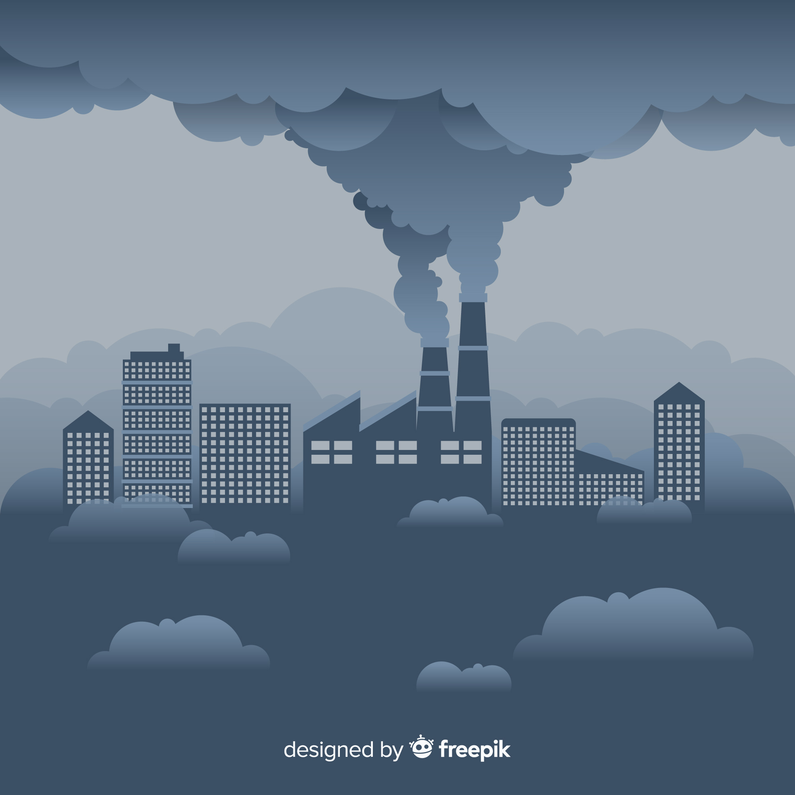

.. nbsphinx-rtd-test documentation master file, created by
   sphinx-quickstart on Wed Sep 28 16:20:38 2016.
   You can adapt this file completely to your liking, but it should at least
   contain the root `toctree` directive.

Willkommen zu einer Sammlung von Praktikumsaufgaben
===================================================

Intro
-----
Hier befindet sich eine kleine Sammlung von Aufgaben und Ideen, mit denen sich Praktikanten 
bei mir am TROPOS beschäftigen könnten. Für Schülerpraktikanten sollte man vielleicht nur
den leichteren Teil der Aufgaben auswählen.

Übersicht
---------
Folgende Aufgaben sind abgelegt

* :doc:`Satelliten-basierte Niederschlagsmessung  <Satellite_based_Precip>` 
.. image:: rainsphere.png
            :width: 300 px
* :doc:`Wolken und ihre Klimawirkung  <Wolken_und_ihre_Klimawirkung>` wird durch das Jupyter Notebook :doc:`Analyse von globale ICON Simulationen  <Analyse_von_globalen_ICON_Simulationen>` vertieft

* :doc:`Feinstaub und Luftqualität  <Feinstaub_und_Luftqualitaet>` wird durch das Jupyter Notebook :doc:`Analyse von modellierten und gemessenen Luftqualitätsdaten  <Luftqualitaet_Modeldaten_plotten>` vertieft

.. toctree::
   :maxdepth: 1 
   :hidden:
   :caption: Aufgaben
   
   Satellite_based_Precip
   Wolken_und_ihre_Klimawirkung
   Feinstaub_und_Luftqualitaet
  
.. toctree::
   :maxdepth: 1 
   :hidden:
   :caption: Jupyter Notebooks
  
   Analyse_von_globalen_ICON_Simulationen
   Luftqualitaet_Modeldaten_plotten

